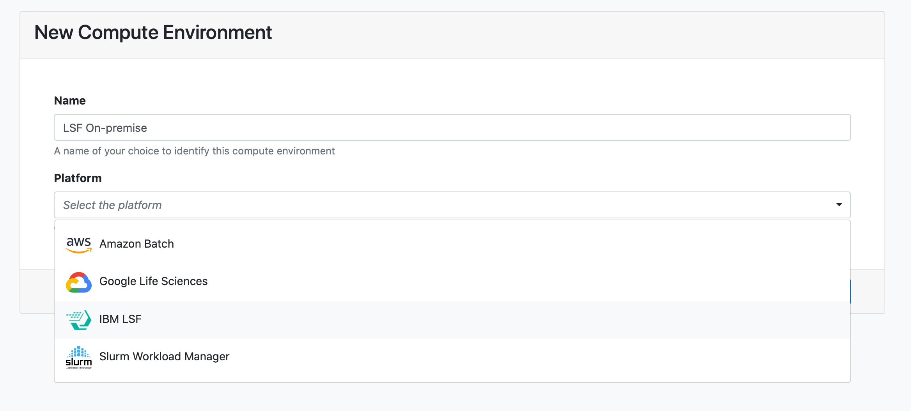
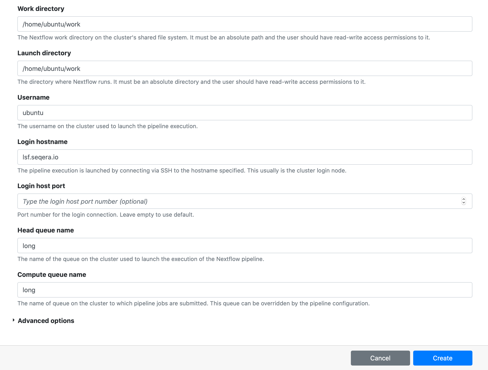

## Overview

[IBM Spectrum LSF](https://www.ibm.com/products/hpc-workload-management/details) is an IBM workload management solution that for HPC. LSF aims to enhance user and administrator experience, reliability and performance at scale.

!!! warning "Support for remote batch schedulers is an incubating feature" 
    This feature enables Tower to connect to remote cloud or on-premise clusters and launch pipelines.

## Requirements

To launch pipelines into a LSF managed cluster from Tower, the following requirements must to be fulfilled:

* The cluster should be reachable via an SSH connection using an SSH key.
* The cluster should allow outbound connections to the Tower web service.
* The cluster queue used to run the Nextflow head job must be able to submit cluster jobs.
* The Nextflow runtime version **21.02.0-edge** (or later) should be installed on the cluster.

## Compute environment

Follow these steps to create a new compute environment for LSF:

**1.** In the navigation bar on the upper right, choose your account name then choose "Compute environments". Click on the *New Environment* button.

**2.** Enter a descriptive name (e.g. *LSF On-premise*) and select **IBM LSF** as the target platform.

**3.** Select the **+** sign to add new SSH credentials.

**4.** Enter a name for the credentials

**5** Enter your **SSH private key** and associated **Passphrase** if required then select **Create**.

!!! tip 
    A passphrase for your SSH key may be optional depending on how it was created. See [here](https://docs.github.com/en/free-pro-team@latest/github/authenticating-to-github/generating-a-new-ssh-key-and-adding-it-to-the-ssh-agent) for detailed instructions for how to create a key.

**6.** Enter the absolute path of the **Work directory** to be used on the cluster.

**7.** Enter the absolute path of the **Launch directory** to be used on the cluster.

**8.** Enter the **Login hostname**. This is usually the cluster login node address.

**9.** The **Head queue name** which is the name of the queue, on the cluster, used to launch the execution of the Nextflow runtime.

**10.** The **Compute queue name** which is the name of queue, on the cluster, to which pipeline jobs are submitted.

!!! tip 
    The Compute queue can be overridden as a configuration option in the Nextflow pipeline configuration. See Nextflow [docs](https://www.nextflow.io/docs/latest/process.html#queue) for more details.

**Advanced options**

**11.** Optionally, you can customize **Nextflow queue size** field to control the number of Nextflow jobs submitted to the queue at the same time.

**12.** Optionally, you can also use the **Unit for memory limits** section to customize the memory limits of your LSF cluster.

**13.** Optionally, you can use the **Head job submit options** to specify options to the head job.

**14.** Select **Create** to finalize the creation of the compute environment.

!!! tip "Congratulations!" 
    You are now ready to launch pipelines.

Jump to the documentation section for [Launching Pipelines](/launch/overview/).
