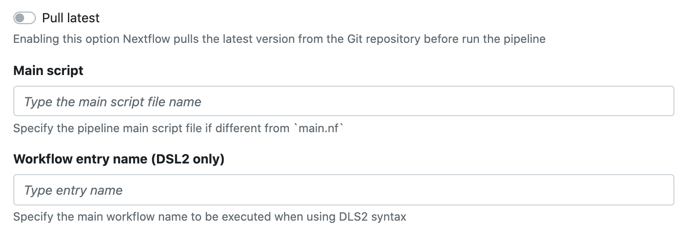

Advanced launch options allow users to modify the configuration and execution of the pipeline.

## Nextflow config file
The *Nextflow config* field allows the addition of settings to the Nextflow configuration file.

This text should follow the same syntax as the [Nextflow configuration file](https://www.nextflow.io/docs/latest/config.html?highlight=profiles#config-syntax).

In the example below, we can modify the **manifest** section to give the pipeline a name and description which will show up in the Tower monitoring section.

After changing the name in the manifest, when monitoring the pipeline, the name has been overwritten.

## Pre & post-run scripts
It is possible to run custom code, either before and after the execution of the Nextflow script. These fields allow users to enter shell commands.

## Pull latest
Enabling this option ensures Nextflow pulls the latest version from the Git repository. This is equivalent to using the `-latest` flag.

## Main script
Nextflow will attempt to run the script named `main.nf` in project repository by default. This can be changed via either the `manifest.mainScript` option or by providing the script filename to run in this field.

## Workflow entry name 
Nextflow DSL2 provides the ability to launch specific named workflows. Enter the name of the workflow to be executed in this field.
