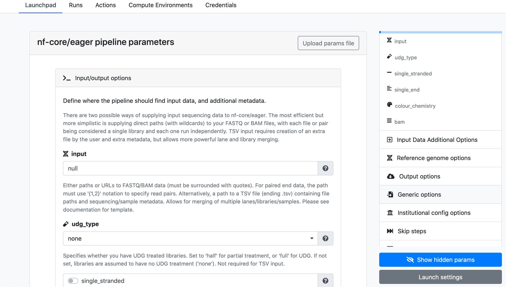

A **Launchpad** is an integral part of the [User](../../getting-started/workspace) and [Organization](../../orgs-and-teams/workspace-management) workspaces. With the **Launchpad** functionality it is possible to curate workflows which are ready to be launched with the associated compute environment and credentials. 

Curating a workflow is similar to [Launch](../overview) with the only difference being that, instead of launching the workflow it gets added to the list of workflows with the pre-saved values of fields such as `pipeline parameters`, `revision number` etc.

!!! tip
    To simplify the parameter specification while curating and launching workflows, it is recommended to use `Nextflow schema`. An increasing number of `nf-core` workflows are quickly adopting this feature for e.g.[rnaseq](https://github.com/nf-core/rnaseq/blob/3.0/nextflow_schema.json) and [eager](https://github.com/nf-core/eager/blob/2.3.3/nextflow_schema.json) .

## Nextflow schema

If your workflow is using the `nextflow_schema.json` file to document the workflow parameters then while launching the workflows from `Launchpad`, Nextflow Tower will automatically detect the presence of `nextflow_schema.json` at the root of the repository and dynamically create a form where the users can easily update the parameters

